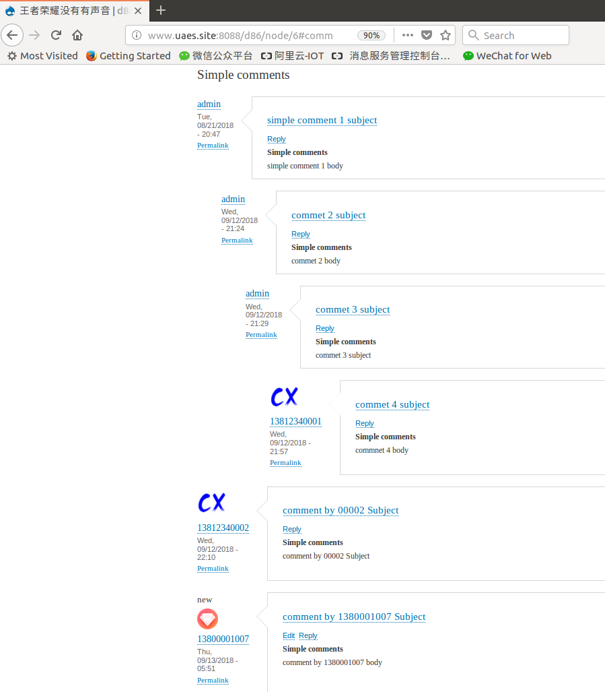

 视频评论描述
---
## 背景

和node user 一样, 评论(commet)也是一个独立的entity,
每个comment 有一个id : cid

### 1 获取视频评论接口

```
curl -X GET -i 'http://www.uaes.site:8088/d86/api/v2/comments/node/6?_format=json'
```
>> 注意: node/后面的数字是 node id (nid)

返回200 OK,  response 如下:
```json
[
    {
        "field_simple_comments":"comment by 1380001007 body",
        "name":"",
        "subject":"comment by 1380001007 Subject",
        "uid":"<a href="/d86/user/5" hreflang="en">13800001007</a>",
        "user_picture":"  

",
        "field_user_mobile":"13800001007",
        "field_user_nickname":"7号昵称",
        "pid":"",
        "thread":"<a href="/d86/comment/35" hreflang="en">03/</a>",
        "cid":"35",
        "replyto_comment":"<a href="/d86/comment/reply/node/6/field_simple_comments_on_video/35">Reply</a>"
    },
    {
        "field_simple_comments":"comment by 00002 Subject",
        "name":"",
        "subject":"comment by 00002 Subject",
        "uid":"<a href="/d86/user/3" hreflang="en">13812340002</a>",
        "user_picture":"  

",
        "field_user_mobile":"13812340002",
        "field_user_nickname":"乌拉圭的癞蛤蟆",
        "pid":"",
        "thread":"<a href="/d86/comment/34" hreflang="en">02/</a>",
        "cid":"34",
        "replyto_comment":"<a href="/d86/comment/reply/node/6/field_simple_comments_on_video/34">Reply</a>"
    },
    {
        "field_simple_comments":"commnet 4 body",
        "name":"",
        "subject":"commet 4 subject",
        "uid":"<a href="/d86/user/2" hreflang="en">13812340001</a>",
        "user_picture":"  

",
        "field_user_mobile":"13812340001",
        "field_user_nickname":"癞蛤蟆",
        "pid":"<a href="/d86/comment/32" hreflang="en">commet 3 subject</a>",
        "thread":"<a href="/d86/comment/33" hreflang="en">01.00.00.00/</a>",
        "cid":"33",
        "replyto_comment":"<a href="/d86/comment/reply/node/6/field_simple_comments_on_video/33">Reply</a>"
    },
    {
        "field_simple_comments":"commet 3 subject",
        "name":"",
        "subject":"commet 3 subject",
        "uid":"<a href="/d86/user/1" hreflang="en">admin</a>",
        "user_picture":"",
        "field_user_mobile":"",
        "field_user_nickname":"",
        "pid":"<a href="/d86/comment/31" hreflang="en">commet 2 subject</a>",
        "thread":"<a href="/d86/comment/32" hreflang="en">01.00.00/</a>",
        "cid":"32",
        "replyto_comment":"<a href="/d86/comment/reply/node/6/field_simple_comments_on_video/32">Reply</a>"
    },
    {
        "field_simple_comments":"commet 2 body",
        "name":"",
        "subject":"commet 2 subject",
        "uid":"<a href="/d86/user/1" hreflang="en">admin</a>",
        "user_picture":"",
        "field_user_mobile":"",
        "field_user_nickname":"",
        "pid":"<a href="/d86/comment/13" hreflang="en">simple comment 1 subject</a>",
        "thread":"<a href="/d86/comment/31" hreflang="en">01.00/</a>",
        "cid":"31",
        "replyto_comment":"<a href="/d86/comment/reply/node/6/field_simple_comments_on_video/31">Reply</a>"
    },
    {
        "field_simple_comments":"simple comment 1 body",
        "name":"",
        "subject":"simple comment 1 subject",
        "uid":"<a href="/d86/user/1" hreflang="en">admin</a>",
        "user_picture":"",
        "field_user_mobile":"",
        "field_user_nickname":"",
        "pid":"",
        "thread":"<a href="/d86/comment/13" hreflang="en">01/</a>",
        "cid":"13",
        "replyto_comment":"<a href="/d86/comment/reply/node/6/field_simple_comments_on_video/13">Reply</a>"
    }
]
```
---
如上返回node6的评论:
网页展示如下:


---

以第二个评论 commet 4 subject 说明各个字段含义:

```json
    {
        "field_simple_comments":"commnet 4 body",
        "name":"",
        "subject":"commet 4 subject",
        "uid":"<a href="/d86/user/2" hreflang="en">13812340001</a>",
        "user_picture":"  

",
        "field_user_mobile":"13812340001",
        "field_user_nickname":"癞蛤蟆",
        "pid":"<a href="/d86/comment/32" hreflang="en">commet 3 subject</a>",
        "thread":"<a href="/d86/comment/33" hreflang="en">01.00.00.00/</a>",
        "cid":"33",
        "replyto_comment":"<a href="/d86/comment/reply/node/6/field_simple_comments_on_video/33">Reply</a>"
    }
```


字段|内容实例|含义
---|:---|---:
"field_simple_comments"|"commnet 4 body"|评论内容(body)
"name"|""|没有用到
"subject"|"commet 4 subject"|评论主题
"uid"|"<a href="/d86/user/2" hreflang="en">13812340001</a>"| 评论者的用户信息 (uid . name)
"user_picture"|"  "|用户图像
"field_user_mobile"|"13812340001"|用户手机 (目前和user name 一致)
"field_user_nickname"|"癞蛤蟆"|用户昵称
"pid"| \<a href="/d86/comment/32" hreflang="en">commet 3 subject</a> |该评论父节点信息,父节点cid=32
"thread"|"<a href="/d86/comment/33" hreflang="en">01.00.00.00/</a>"|表明改评论是第4级评论
"cid"|"33"|评论id ,commnet id
"replyto_comment"|<a href="/d86/comment/reply/node/6/field_simple_comments_on_video/33>Reply</a>"|保留